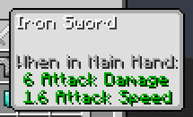

# KM Custom Tooltip Background Mod (Fabric)

Allows you to change the tooltip background through a json file ("assets/kmcustomtooltipbg/tooltip_background.json")

### Example
```json
{
  "enabled": true,
  "texture": "minecraft:textures/gui/toasts.png",
  "uv": [0, 32],
  "uv_size": [160, 32],
  "nineslice_size": [4, 4, 4, 4],
  "base_size": [256, 256]
}
```



### Properties

```ts
  enabled: boolean
  texture: Identifier
  padding: [int, int, int, int] | [int, int] | int 
  offset: [int, int]
  uv: [int, int]
  uv_size: [int, int]
  nineslice_size: [int, int, int, int] | [int, int] | int
  base_size: [int, int]
  color: [float, float, float] | [float, float, float, float]
  alpha: float
```